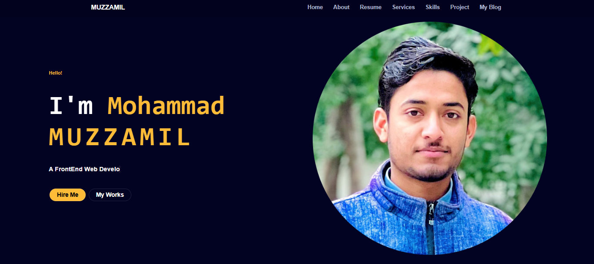

# Personal Portfolio Website - Front-End Development Project
# Project Overview
Designed and developed a modern, responsive personal portfolio website that serves as a professional showcase for Mohammad Muzzamil, a Front-End Web Developer. The website features a clean, dark-themed interface with intuitive navigation and clear call-to-action elements.
Design Elements

# Screenshot
Here we have project screenshot :

Implemented a sophisticated dark navy color scheme with vibrant orange accents for emphasis and visual hierarchy
Created a circular profile image treatment with subtle border effects to enhance visual appeal
Utilized modern typography with varying weights and sizes to establish clear content hierarchy
Incorporated ample negative space for improved readability and user experience

# Technical Implementation

Developed a fully responsive layout that adapts seamlessly across all device sizes
Implemented a fixed navigation menu with proper spacing and highlighting for easy site exploration
Created smooth hover effects and transitions for interactive elements
Integrated social proof elements and clear call-to-action buttons ("Hire Me" and "My Works")
Ensured accessibility standards were met with proper contrast ratios and semantic HTML

# Key Features

Professional hero section with personal introduction and clear value proposition
Strategically placed navigation menu with links to key sections (Home, About, Resume, Services, Skills, Projects, Blog)
Prominent call-to-action buttons to encourage visitor engagement
Clean, professional branding that establishes credibility as a web developer

This portfolio website effectively communicates Mohammad Muzzamil's professional identity as a Front-End Web Developer while demonstrating his technical skills through the implementation itself.
